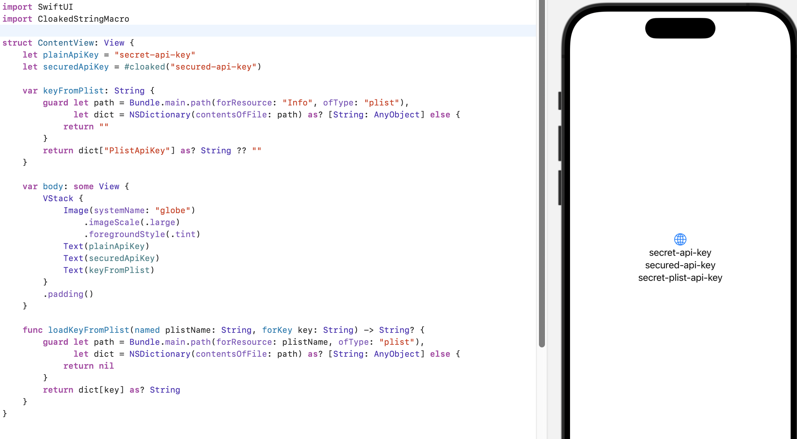
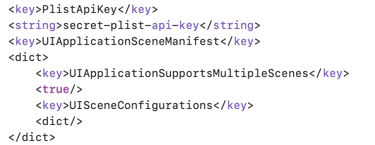
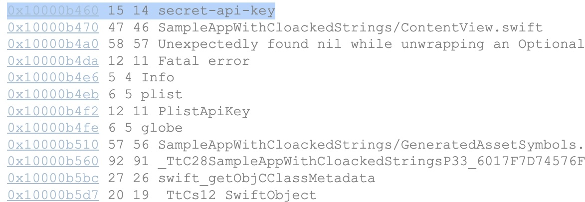

## Overview

This project presents an extension to the Swift `#cloaked` macro, which is designed to improve the security of open text strings in Swift applications. By converting strings to `Data` format using the `UInt8` field, it makes it much harder to easily extract strings from a decompressed application. This method is particularly useful for protecting sensitive data and strings in Swift projects from reverse engineering efforts.

The figure below shows a sample application that uses different methods to store sensitive strings. Plain String variable, value stored in Plist and string masked by `#cloaked` macro.



Storing sensitive API keys in iOS applications requires careful consideration of security aspects to prevent unauthorized access. The simplest targets for attackers are often keys stored directly in PLIST files, as these files can be easily explored and their information extracted. 




Similarly, during the decompilation of an application, it's relatively easy to identify and read strings containing sensitive data.



 The most effective strategy for protecting this information, which prevents direct reading of these details, is the dynamic loading of keys after user authentication. This approach significantly complicates the acquisition of sensitive data, as keys are not stored directly in the application and are loaded only when they are truly needed.

If dynamic loading is not feasible for some reason, an alternative solution can be to store the keys not as plain strings but as byte arrays. This method makes the identification and extraction of keys from the decompiled code much more difficult, as a byte array is not as straightforward to recognize and interpret as text strings. Although no method offers an absolute guarantee of security, employing these practices significantly enhances the protection of sensitive data stored in iOS applications.


If you're considering storing api keys or other sensitive strings securely in your iOS app, consider using the `#cloaked` macro. The plain strings used in a compiled app are the easiest thing to read from the app.


## Features

- **String masking:** Automatically converts plain text strings to `Data([UInt8])` format, hiding their actual content from analysis.
- **Easy integration:** The extension can be seamlessly integrated into existing projects without requiring extensive code modifications.
- **Enhanced security:** Helps protect sensitive data in the application from unintentional or intentional inspection.


## Installation

To add the `#cloaked` extension to your Swift project, simply include the `Cloaked.swift` file and follow the instructions to use it.


## Usage

To use `#cloaked` with your strings, simply wrap your plain text strings with the `#cloaked` macro as shown below:

Source code:
```swift
let secureString = #cloaked("secret")
```

Expanded source:
```swift
String(data: Data([115, 101, 99, 114, 101, 116]), encoding: .utf8)!
```

## Installation

### [Swift Package Manager](https://www.swift.org/package-manager/) (SPM)

Add the following line to the dependencies in `Package.swift`, to use CloakedStringMacro macro in a SPM project:

```swift
.package(url: "https://github.com/pykaso/swiftmacro-cloaked-string.git", from: "0.1.0"),
```

In your target:

```swift
.target(name: "<TARGET_NAME>", dependencies: [
    .product(name: "CloakedStringMacro", package: "swiftmacro-cloaked-string"),
    // ...
]),
```

Add `import CloakedStringMacro` into your source code to use CloakedStringMacro macro.

## Licensing

This project is available under the MIT License. See the LICENSE file for more information.


## Contributing

Contributions are warmly welcomed! If you have an idea on how to improve #cloaked, please feel free to create an issue or pull request.


